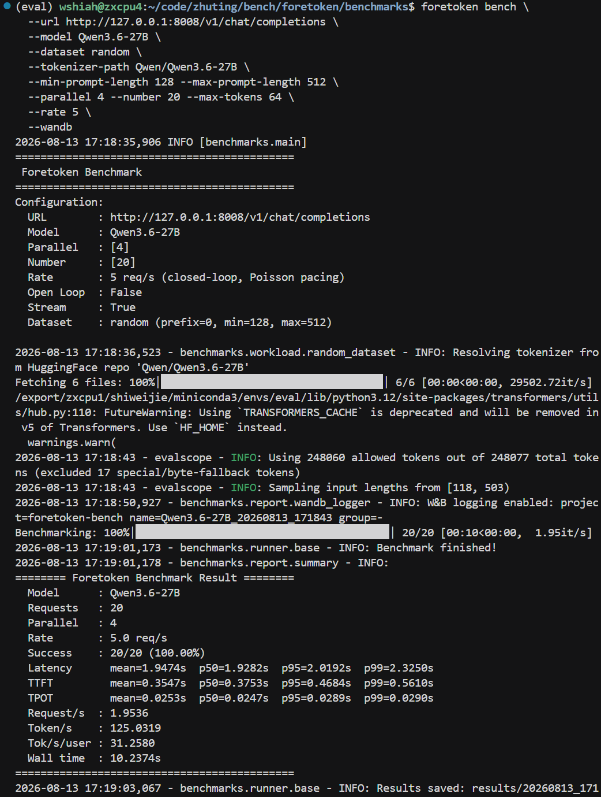
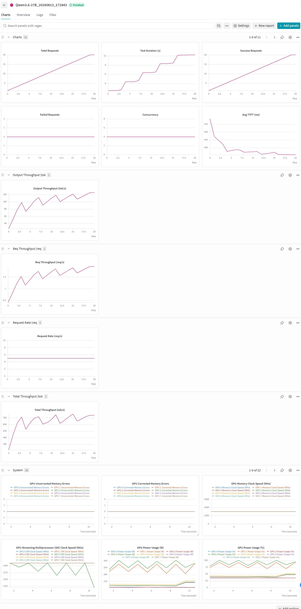
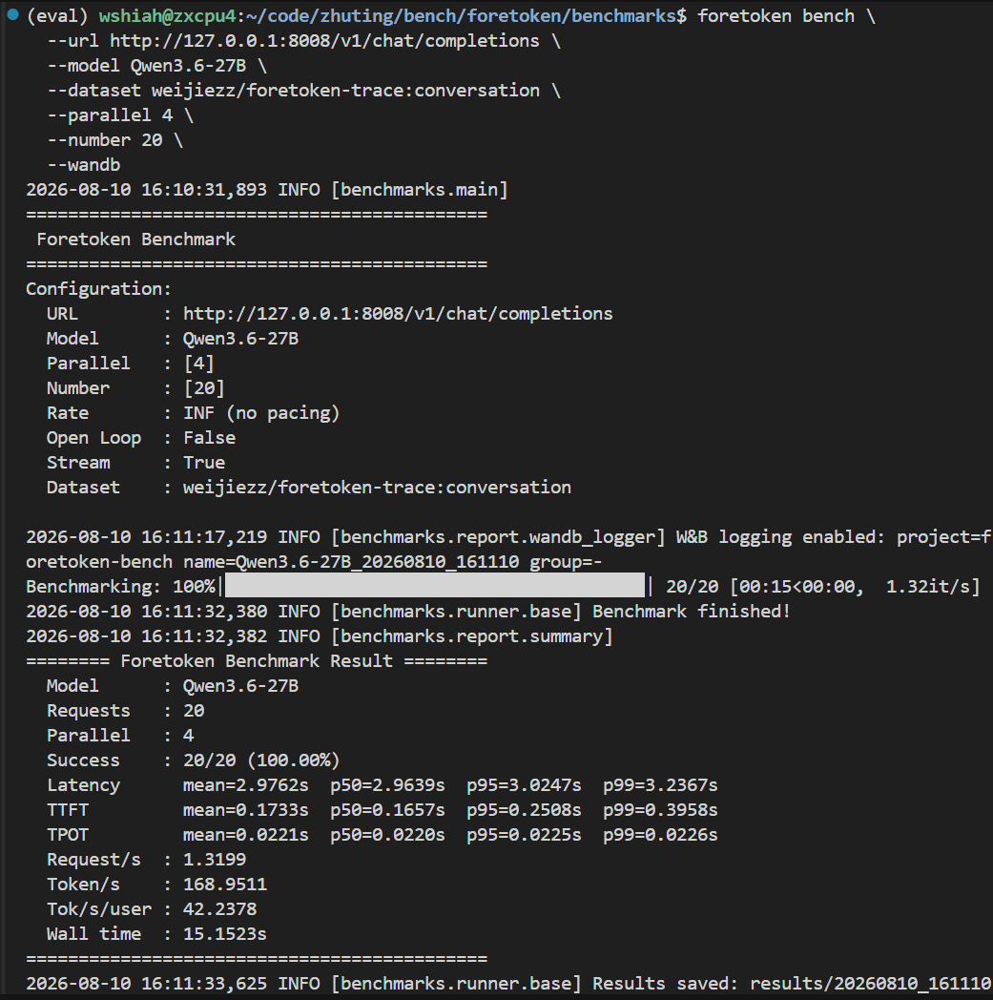
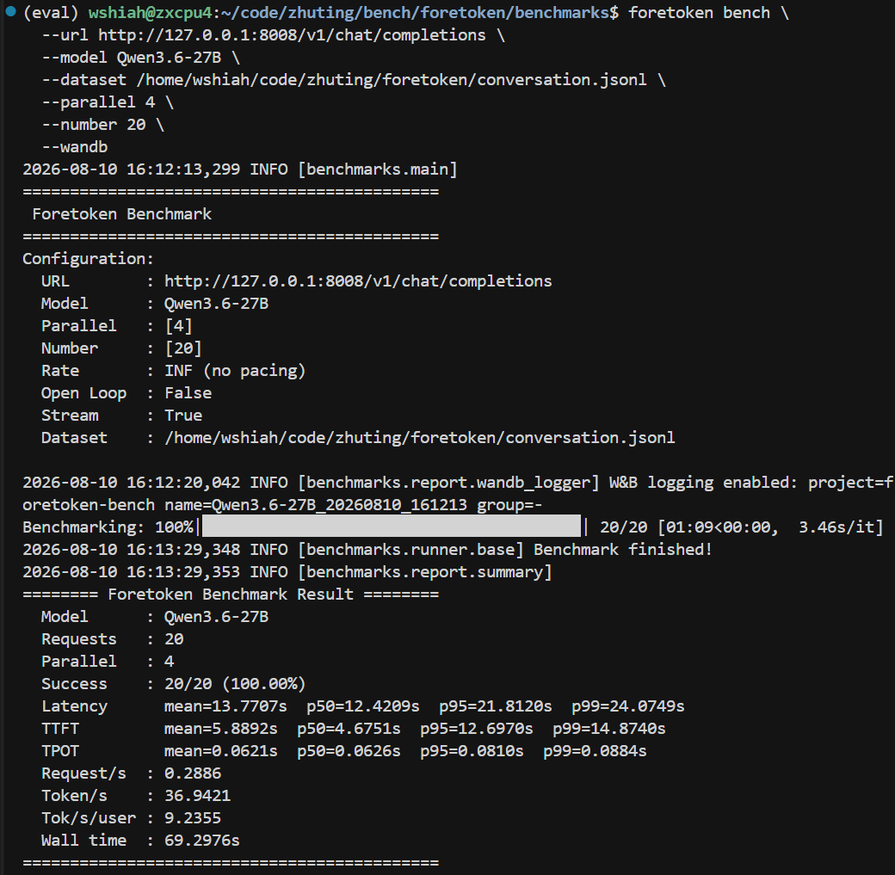
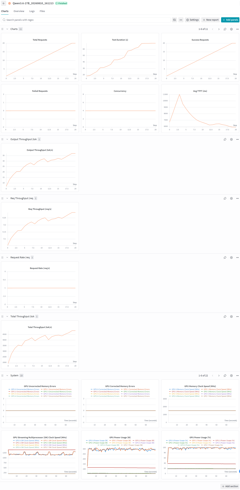
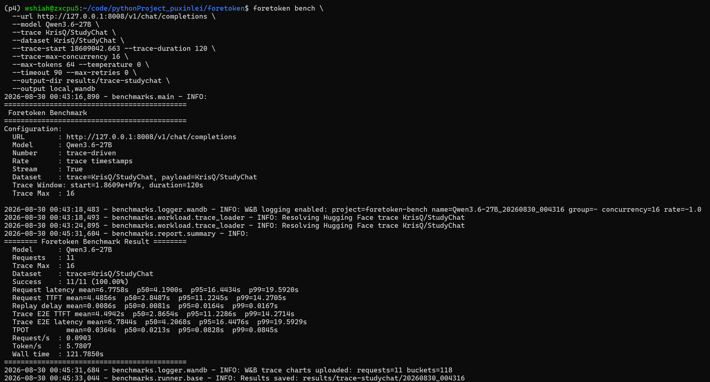
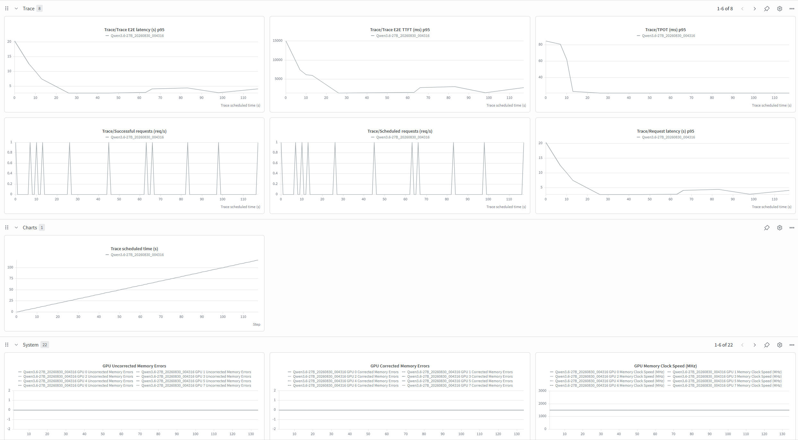
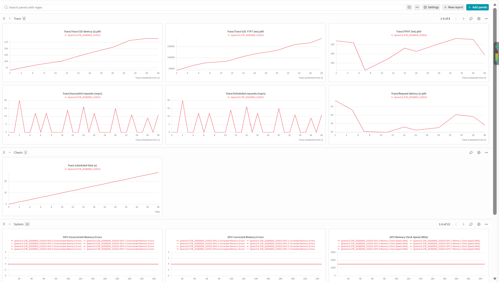
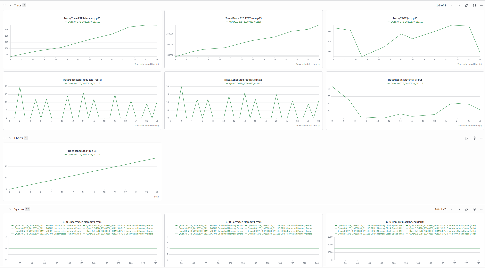
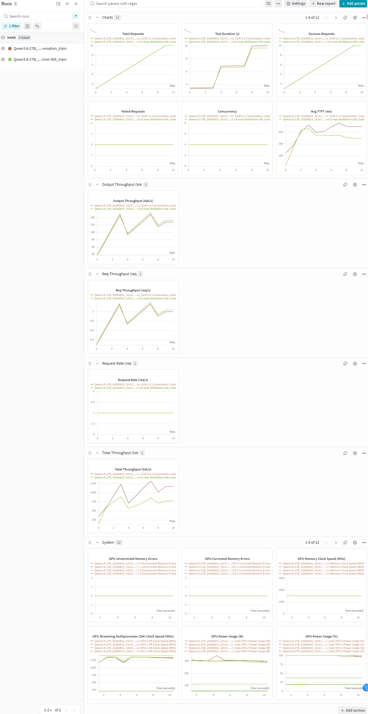

# Foretoken deployment

Deploy or reuse the Quick Start service, discover its model and endpoint, and clean up resources created for the benchmark:

```bash
foretoken bench examples/quickstart
```

# Random dataset

```
foretoken bench \
  --url http://127.0.0.1:8008/v1/chat/completions \
  --model Qwen3.6-27B \
  --dataset random \
  --tokenizer-path Qwen/Qwen3.6-27B \
  --random-seed 0 \
  --min-prompt-length 128 --max-prompt-length 512 \
  --parallel 4 --number 20 --max-tokens 64 \
  --rate 5 \
  --output local,wandb
```





# HuggingFace dataset

```
foretoken bench \
  --url http://127.0.0.1:8008/v1/chat/completions \
  --model Qwen3.6-27B \
  --dataset weijiezz/foretoken-trace:conversation \
  --parallel 4 \
  --number 20 \
  --output local,wandb
```




# Local dataset

```
foretoken bench \
  --url http://127.0.0.1:8008/v1/chat/completions \
  --model Qwen3.6-27B \
  --dataset /path/to/conversation.jsonl \
  --parallel 4 \
  --number 20 \
  --output local,wandb
```





# StudyChat trace + dataset

```
foretoken bench \
  --url http://127.0.0.1:8008/v1/chat/completions \
  --model Qwen3.6-27B \
  --trace KrisQ/StudyChat \
  --dataset KrisQ/StudyChat \
  --trace-start 18609042.663 --trace-duration 120 \
  --trace-max-concurrency 16 \
  --max-tokens 64 --temperature 0 \
  --timeout 90 --max-retries 0 \
  --output-dir results/trace-studychat \
  --output local,wandb
```





# Mooncake trace + StudyChat dataset

```
foretoken bench \
  --url http://127.0.0.1:8008/v1/chat/completions \
  --model Qwen3.6-27B \
  --trace valeriol29/mooncake-traces \
  --dataset KrisQ/StudyChat \
  --trace-start 540 --trace-duration 120 \
  --trace-max-concurrency 16 \
  --max-tokens 64 --temperature 0 \
  --timeout 90 --max-retries 0 \
  --output-dir results/trace-mooncake-dataset \
  --output local,wandb
```


# Mooncake trace + random

```
foretoken bench \
  --url http://127.0.0.1:8008/v1/chat/completions \
  --model Qwen3.6-27B \
  --trace valeriol29/mooncake-traces \
  --trace-start 2620 --trace-duration 30 \
  --dataset random \
  --tokenizer-path Qwen/Qwen3.6-27B \
  --random-seed 0 \
  --trace-max-concurrency 16 \
  --max-tokens 64 --temperature 0 \
  --timeout 90 --max-retries 0 \
  --output-dir results/trace-mooncake-random \
  --output local,wandb
```




# Mooncake trace + synthetic prefix reuse

```
foretoken bench \
  --url http://127.0.0.1:8008/v1/chat/completions \
  --model Qwen3.6-27B \
  --trace valeriol29/mooncake-traces \
  --trace-start 2620 --trace-duration 30 \
  --dataset random \
  --tokenizer-path Qwen/Qwen3.6-27B \
  --random-seed 0 \
  --trace-synthetic-prefix-reuse \
  --trace-max-concurrency 16 \
  --max-tokens 64 --temperature 0 \
  --timeout 90 --max-retries 0 \
  --output-dir results/trace-mooncake-prefix \
  --output local,wandb
```




# Multi-dataset

```
foretoken bench \
  --url http://127.0.0.1:8008/v1/chat/completions \
  --model Qwen3.6-27B \
  --dataset r0b0tlab/qwen3.8-max-distillation-50k:train,ianncity/GLM-5.2-Conversation:train \
  --parallel 4 \
  --number 20 \
  --output local,wandb
```



