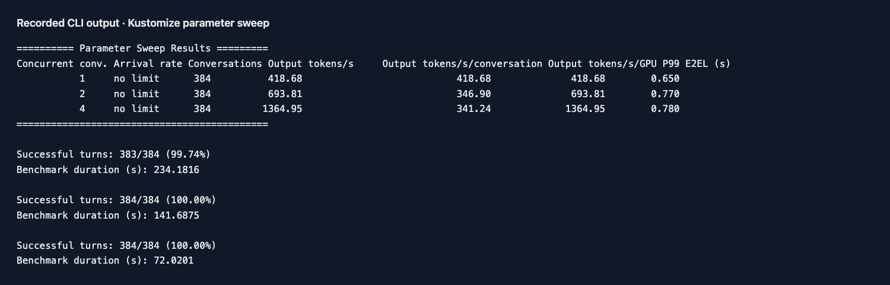
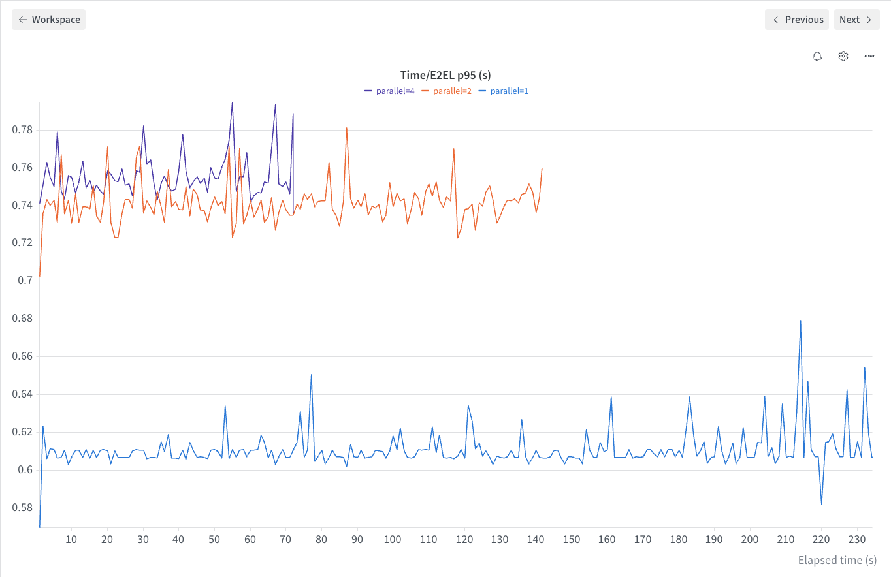
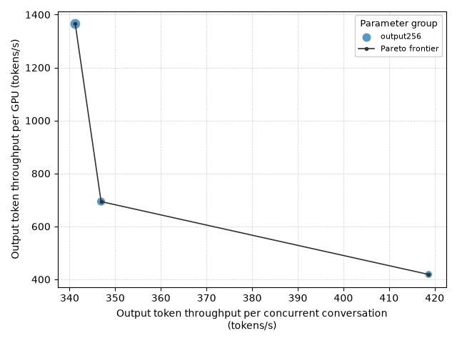

# Parameter sweeps

English | [简体中文](sweep_zh.md) · [Common commands](../examples.md)

After [setup](../examples.md#setup), deploy the service and warm it up before comparing concurrency levels:

```bash
foretoken deploy examples/quickstart --timeout 20m
for parallel in 1 2 4; do
  foretoken bench examples/quickstart \
    --dataset random --tokenizer-path Qwen/Qwen3-0.6B \
    --min-prompt-length 128 --max-prompt-length 256 --random-seed 0 \
    --min-output-length 256 --max-output-length 256 \
    --parallel "$parallel" --number 16 --output local
done
```

Run the [parameter file](../../examples/sweep.jsonl) with the same inputs:

```bash
foretoken bench examples/quickstart \
  --dataset random --tokenizer-path Qwen/Qwen3-0.6B \
  --min-prompt-length 128 --max-prompt-length 256 --random-seed 0 \
  --sweep benchmarks/examples/sweep.jsonl \
  --experiment-name quickstart-sweep \
  --output local,wandb
```

Each JSONL row defines a parameter group. Lists of `parallel`, `number`, or `rate` expand into points. Only one of `parallel` and `rate` may be a multi-value list in a row; a multi-value `number` list must match that axis's length.

Each row may change load, generation, or dataset settings, including output-length bounds. Service identity, credentials, trace source, and output destinations stay fixed. Sweeps cannot be combined with trace replay or multiple datasets. `--num-runs` repeats each point.

Each point has a result directory. `sweep_points.json` records all results, and `pareto/PARETO.png` compares output token throughput per configured user with throughput per GPU when enough points are available. Choose a fresh `--experiment-name` for another experiment, or omit it to use an automatically created directory.

Delete the service after finishing with `foretoken delete examples/quickstart`.

## Example output

Qwen3-0.6B on one A100 80GB PCIe GPU:



W&B shows E2EL p95 in one-second completion windows; the Pareto plot compares whole-run throughput.




