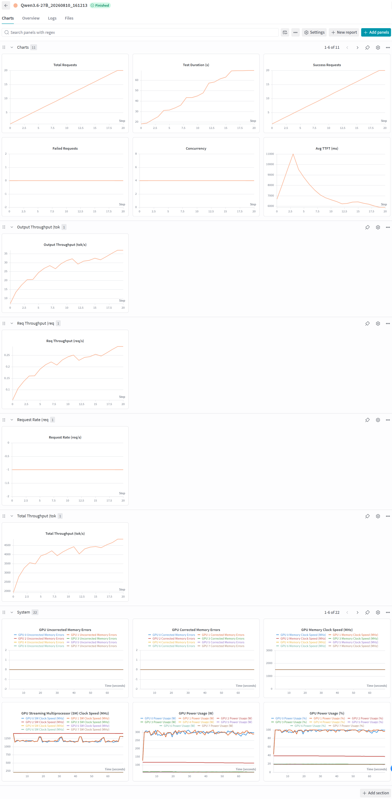
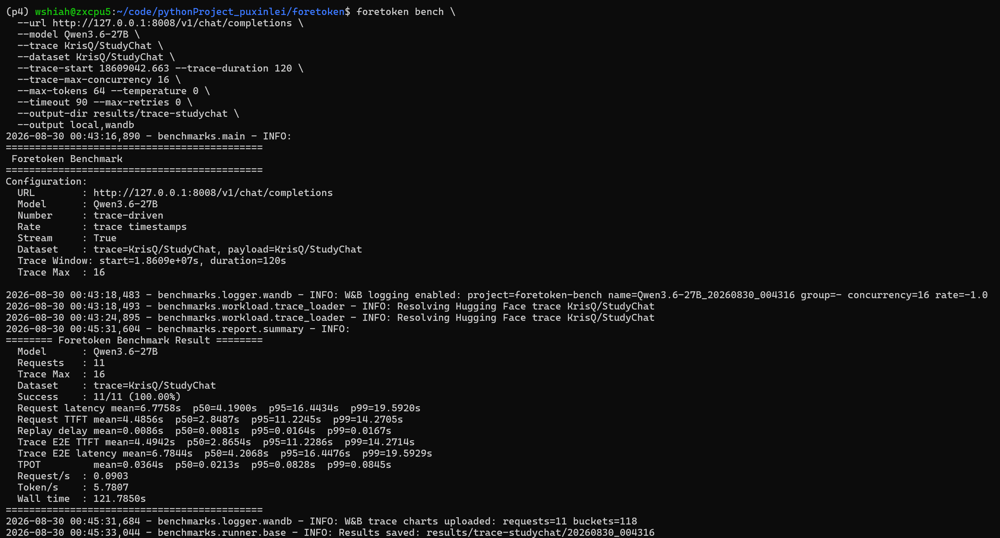
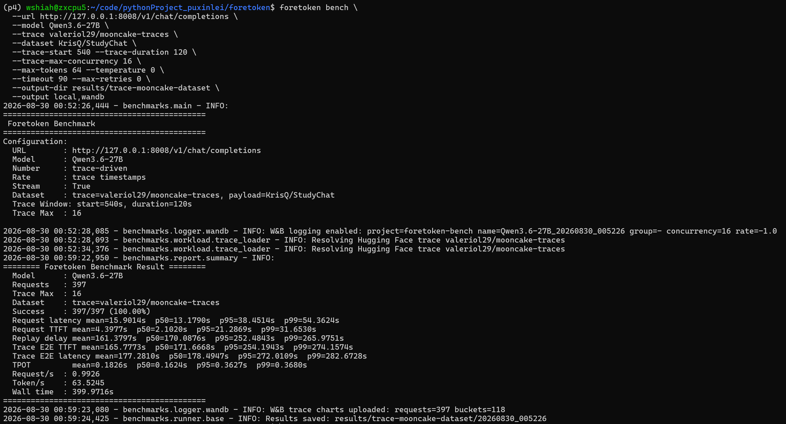
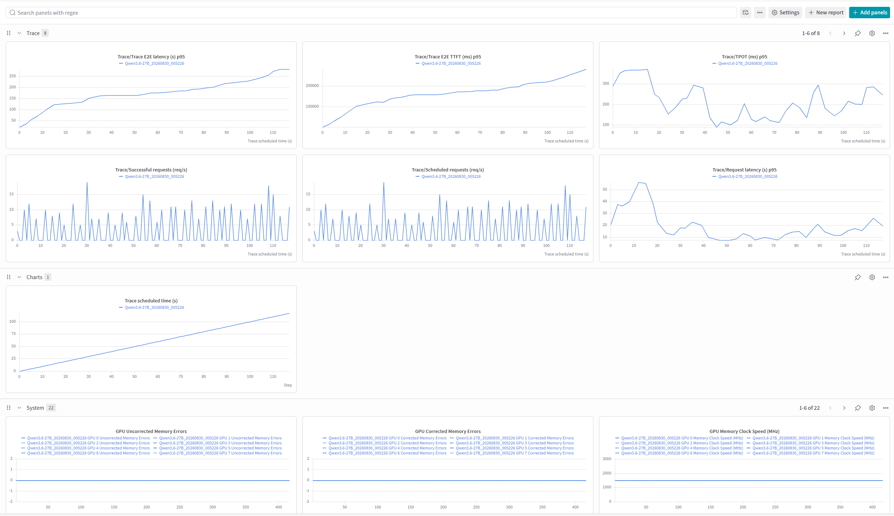
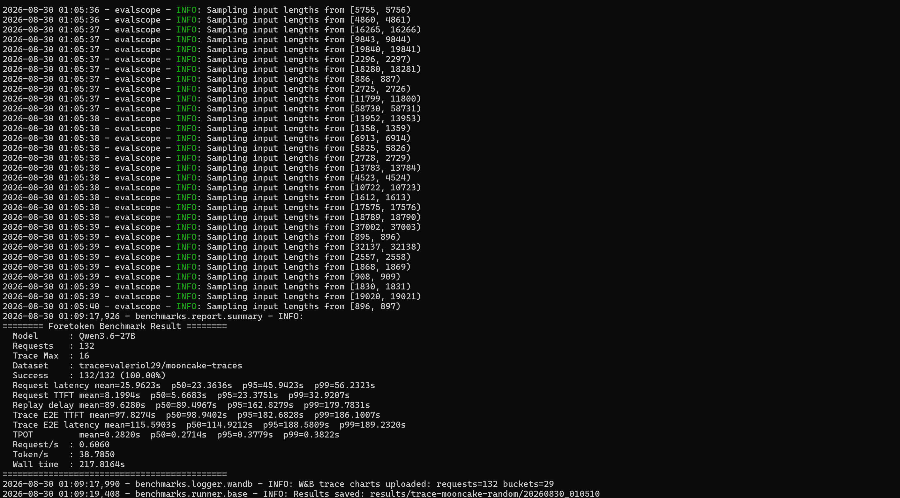
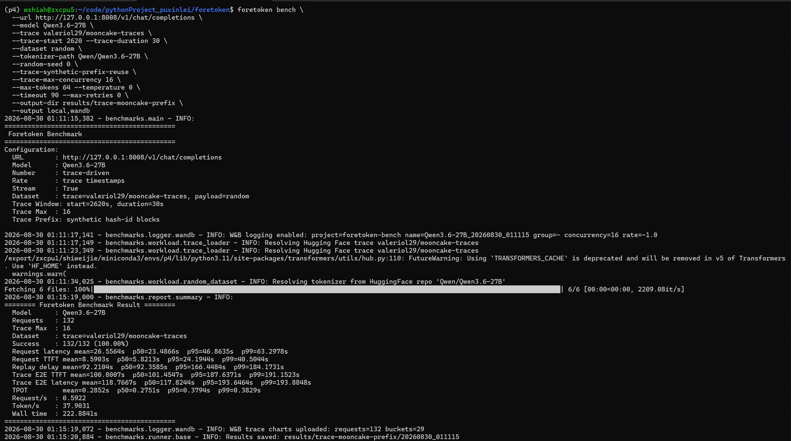
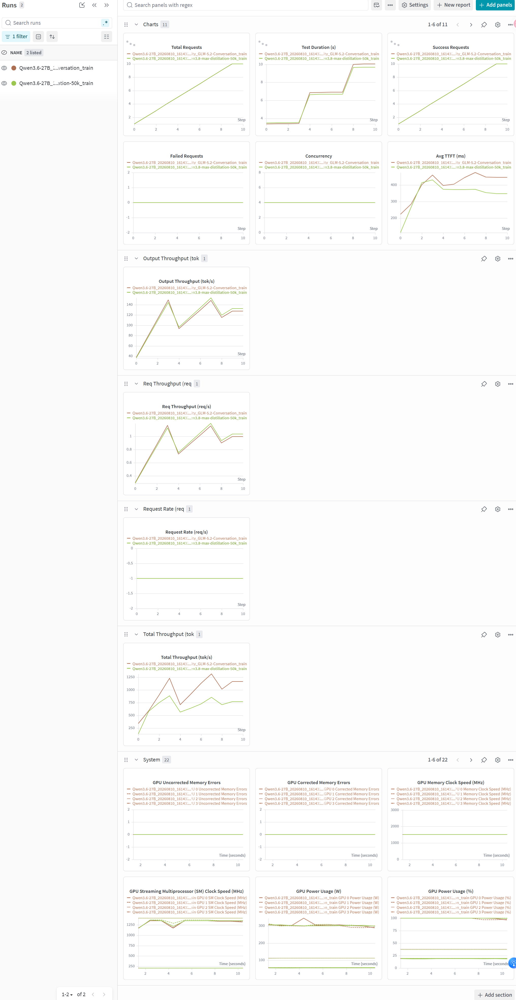
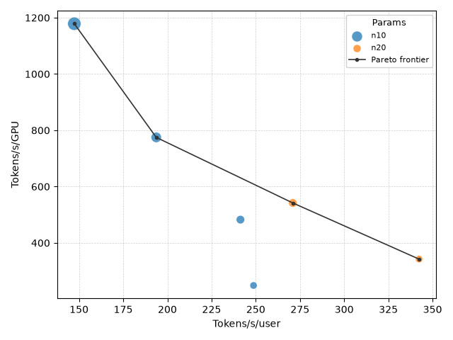
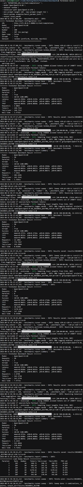
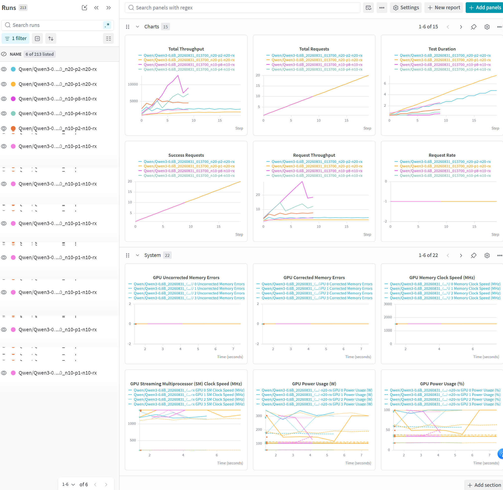

# 评测示例

[English](examples.md) | 简体中文

# Foretoken 部署

部署或复用快速开始服务，自动发现模型和访问入口，并在评测结束后清理本次创建的资源：

```bash
foretoken bench examples/quickstart
```

以下示例连接已经运行的服务。默认上传 W&B；W&B 不可用时，评测会继续保存本地结果。

# 数据集来源

`--dataset` 支持本地 JSONL、Hugging Face 数据集，以及数据集仓库中的文件：

```text
/path/to/conversation.jsonl
org/dataset:train
hf://datasets/org/dataset@main/path/to/conversation.jsonl
```

多个来源可用逗号分隔。Hub 文件 URI 必须包含 `datasets` 仓库类型。

# 随机数据集

```
foretoken bench \
  --url http://127.0.0.1:8008/v1/chat/completions \
  --model Qwen3.6-27B \
  --dataset random \
  --tokenizer-path Qwen/Qwen3.6-27B \
  --random-seed 0 \
  --min-prompt-length 128 --max-prompt-length 512 \
  --parallel 4 --number 20 --max-tokens 64 \
  --rate 5
```


# Hugging Face 数据集

```
foretoken bench \
  --url http://127.0.0.1:8008/v1/chat/completions \
  --model Qwen3.6-27B \
  --dataset weijiezz/foretoken-trace:conversation \
  --parallel 4 \
  --number 20
```


# 本地数据集

```
foretoken bench \
  --url http://127.0.0.1:8008/v1/chat/completions \
  --model Qwen3.6-27B \
  --dataset /path/to/conversation.jsonl \
  --parallel 4 \
  --number 20
```




# StudyChat 轨迹与数据集

```
foretoken bench \
  --url http://127.0.0.1:8008/v1/chat/completions \
  --model Qwen3.6-27B \
  --trace KrisQ/StudyChat \
  --dataset KrisQ/StudyChat \
  --trace-start 18609042.663 --trace-duration 120 \
  --trace-max-concurrency 16 \
  --max-tokens 64 --temperature 0 \
  --timeout 90 --max-retries 0 \
  --output-dir results/trace-studychat
```




# Mooncake 轨迹与 StudyChat 数据集

```
foretoken bench \
  --url http://127.0.0.1:8008/v1/chat/completions \
  --model Qwen3.6-27B \
  --trace valeriol29/mooncake-traces \
  --dataset KrisQ/StudyChat \
  --trace-start 540 --trace-duration 120 \
  --trace-max-concurrency 16 \
  --max-tokens 64 --temperature 0 \
  --timeout 90 --max-retries 0 \
  --output-dir results/trace-mooncake-dataset
```





# Mooncake 轨迹与随机数据

```
foretoken bench \
  --url http://127.0.0.1:8008/v1/chat/completions \
  --model Qwen3.6-27B \
  --trace valeriol29/mooncake-traces \
  --trace-start 2620 --trace-duration 30 \
  --dataset random \
  --tokenizer-path Qwen/Qwen3.6-27B \
  --random-seed 0 \
  --trace-max-concurrency 16 \
  --max-tokens 64 --temperature 0 \
  --timeout 90 --max-retries 0 \
  --output-dir results/trace-mooncake-random
```




# Mooncake 轨迹与合成前缀复用

```
foretoken bench \
  --url http://127.0.0.1:8008/v1/chat/completions \
  --model Qwen3.6-27B \
  --trace valeriol29/mooncake-traces \
  --trace-start 2620 --trace-duration 30 \
  --dataset random \
  --tokenizer-path Qwen/Qwen3.6-27B \
  --random-seed 0 \
  --trace-synthetic-prefix-reuse \
  --trace-max-concurrency 16 \
  --max-tokens 64 --temperature 0 \
  --timeout 90 --max-retries 0 \
  --output-dir results/trace-mooncake-prefix
```




# 多数据集

```
foretoken bench \
  --url http://127.0.0.1:8008/v1/chat/completions \
  --model Qwen3.6-27B \
  --dataset r0b0tlab/qwen3.8-max-distillation-50k:train,ianncity/GLM-5.2-Conversation:train \
  --parallel 4 \
  --number 20
```





# 参数扫描

通过 `--bench-params` 传入 JSONL 文件，每行覆盖请求执行字段。`parallel`、`number` 或 `rate` 的列表值会展开为独立负载点；`rate` 为 `-1` 时按最快速度发送请求。

示例（`benchmarks/examples/bench_params.jsonl`）：

```jsonl
{"_benchmark_name": "n10", "parallel": [1, 2, 4, 8], "number": 10, "max_tokens": 64}
{"_benchmark_name": "n20", "parallel": [1, 2], "number": 20, "max_tokens": 128}
```

```bash
foretoken bench examples/quickstart \
  --dataset random \
  --tokenizer-path Qwen/Qwen3-0.6B \
  --min-prompt-length 128 --max-prompt-length 512 \
  --bench-params benchmarks/examples/bench_params.jsonl
```

实验会保存全部负载点，并生成 `pareto/PARETO.png`，比较每用户和每 GPU 的输出 token/s。






