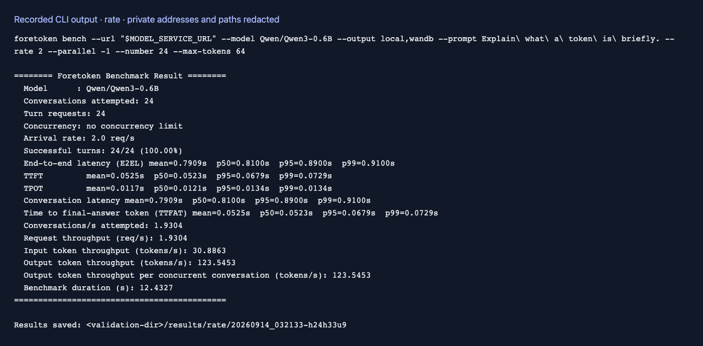

# Arrival patterns and concurrency

English | [简体中文](arrival-rate_zh.md) · [Performance examples](README.md)

Use concurrency to measure capacity, or a request rate to model incoming traffic. Run these examples after [setup](README.md#setup).

## Keep the service busy

```bash
foretoken perf examples/quickstart --prompt Hello \
  --max-concurrency 16 --num-prompts 100 --max-tokens 128 --output local
```

Without a rate limit, new work starts as capacity becomes available. `--max-concurrency` defaults to 1; `-1` removes the limit. For multi-turn data, it limits conversations in progress, while `--num-prompts` counts the total HTTP turns.

## Set an arrival rate

```bash
foretoken perf examples/quickstart --prompt Hello \
  --request-rate 5 --max-concurrency 16 --num-prompts 100 \
  --max-tokens 128 --output local
```

The target is an average of five requests/s, using Poisson arrivals. With multi-turn data, the rate controls conversation starts instead. The concurrency limit can delay starts when earlier work has not finished; `--max-concurrency -1` removes that constraint.

| Arrival choice | Timing |
| --- | --- |
| `--arrival-pattern poisson` (default) | Random intervals averaging the selected rate |
| `--arrival-pattern constant` | Fixed intervals |
| `--arrival-pattern gamma --burstiness 0.5` | Bursty intervals; smaller shape values are more bursty, 1 is Poisson |

`constant` and `gamma` require a positive `--request-rate`. The default `--request-rate -1` sends as fast as possible. Use [trace replay](studychat.md) for recorded timestamps.

## Measure for a fixed duration

```bash
foretoken perf examples/quickstart --prompt Hello \
  --max-concurrency 16 --duration 5min --max-tokens 128 --output local
```

New requests stop after five minutes; in-flight requests finish. Omit `--num-prompts` for a duration-only run, or supply both to stop at whichever bound is reached first. An unlimited, unrated workload requires a request budget rather than `--duration`.

Time options accept `ms`, `s`, `m`/`min`, `h`, or `d`; unitless values use seconds. Add `--warmup-requests` to run warmup before measurement, excluded from the summary.

## Read the load response

Compare requested rate with achieved throughput, observed request concurrency, and latency percentiles. [Sweeps](sweep.md) compare several rates or limits; [SLO measurement](slo.md) reports the share of requests meeting latency targets.


