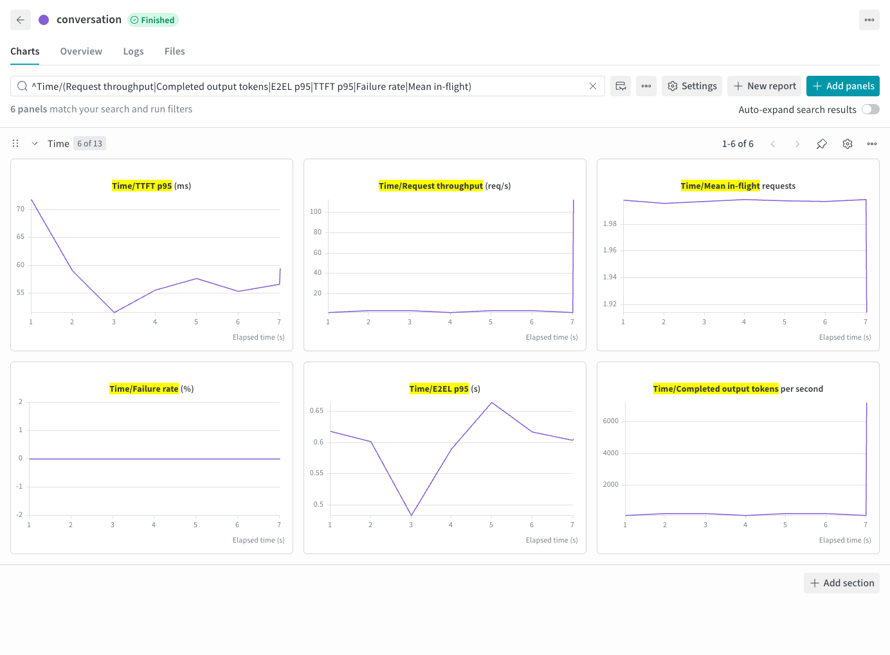

# 本地对话数据

[English](conversations.md) | 简体中文 · [性能评测示例](README_zh.md)

回放记录的对话，测量历史增长和逐轮生成的开销。完成[准备步骤](README_zh.md#准备)后，运行[示例数据](../../examples/conversations.jsonl)：

```bash
foretoken perf examples/quickstart \
  --dataset benchmarks/examples/conversations.jsonl \
  --num-prompts 3 --max-concurrency 2 --output local
```

该命令发送三个 HTTP 请求，完成一个单轮对话和一个两轮对话。同一对话的下一轮等待上一轮响应结束。`--num-prompts` 统计全部对话的 HTTP 轮次，`--max-concurrency` 限制同时进行的对话数。添加 `--max-turns 1` 可只运行各段对话的首轮，并相应调整请求预算。

## 准备自己的数据

每行保存一个 JSON 对象，例如 `conversations.jsonl`：

```json
{"messages":[{"role":"user","content":"Name a planet."},{"role":"assistant","content":"Mars."},{"role":"user","content":"Name another one."}]}
```

将命令中的示例路径换成此文件。`messages` 使用 OpenAI 格式的角色和内容，可包含 system 消息；支持图片的模型也可接收图片内容。数据行还可使用字符串 `prompt`，或 `user` 与可选 `system`。也支持包含对话记录的 JSON 数组。其他输入见 [ShareGPT](sharegpt_zh.md)、[Hugging Face 来源](huggingface_zh.md)和[工具数据](tools_zh.md)。

可选字段用于控制单条请求：

| 字段 | 含义 |
| --- | --- |
| `model` | 公开模型 ID；省略时使用所选服务模型 |
| `output_length` | 正整数，指定精确输出 token 数 |
| `priority` | 发送给支持优先级调度的服务的整数 |
| `request_class` | 结果分组标签，例如 `interactive` |

URL 或多模型部署的数据行可直接提供模型 ID，代替 `--model`。整数数组 `prompt`（例如 `{"prompt":[1,42,73],"output_length":32}`）作为一条已分词的 Completions 请求发送，不套聊天模板；token ID 应与服务模型的 tokenizer 一致。

## 选择对话历史

默认 `--conversation-history dataset` 使用记录的 assistant 答案构成后续历史，每轮仍请求模型生成新回答以测量性能。改用 `--conversation-history generated`，则将服务本次实际生成的回答用于后续轮次。

## 控制输出长度

有非空文本参考答案的轮次，按该答案的 token 数定长生成。长度在测量前用请求模型的 tokenizer 计算，不添加特殊 token。模型使用服务别名或单独存放 tokenizer 时，可用 `--tokenizer-path` 指定。

输出目标依次采用数据行的 `output_length`、显式 `--min-output-length`/`--max-output-length` 范围、参考答案 token 数。没有文本参考答案时，使用 `--max-tokens` 上限并允许自然结束。精确目标要求服务支持 `min_tokens`、`ignore_eos` 并报告 token 用量；未达到目标的请求记为失败。

在结果中查看目标与实际 token 数、请求标签和每轮耗时。[多数据集](multi-dataset_zh.md)可将多个对话来源混合为一组负载。


