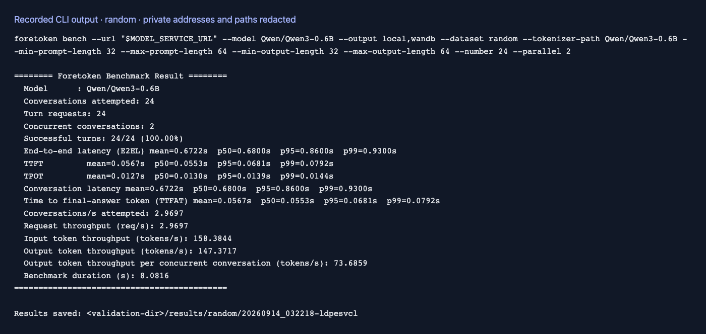

# 随机负载

[English](random.md) | 简体中文 · [性能评测示例](README_zh.md)

完成[准备步骤](README_zh.md#准备)后，生成随机输入，并为每次请求抽取目标输出长度：

```bash
foretoken perf examples/quickstart \
  --dataset random \
  --min-prompt-length 128 --max-prompt-length 512 \
  --min-output-length 64 --max-output-length 256 \
  --prefix-length 64 --random-seed 0 \
  --max-concurrency 4 --num-prompts 20 --output local,wandb
```

随机负载使用所选 tokenizer 生成目标长度的输入，最终 token 数以服务报告的输入用量为准。`--prefix-length` 增加共享前缀。tokenizer 从模型服务推导；使用服务别名或单独存放 tokenizer 时，用 `--tokenizer-path` 指定。会复用本地模型文件和缓存的 tokenizer，`FORETOKEN_HF_ENDPOINT` 可选择 Hugging Face 地址。

输出范围包含上下界，并覆盖 `--max-tokens`。服务需要支持 `min_tokens`、`ignore_eos` 并返回输出用量；未达到目标长度的请求记为失败。不传这两个参数时，普通生成允许提前结束。

## 输出示例

以下运行使用较小的长度范围：




