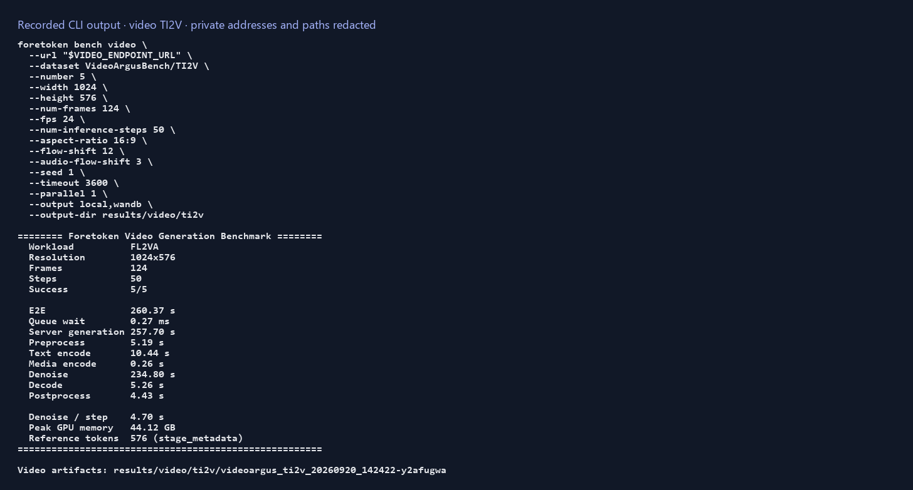

# Video generation

English | [简体中文](video_zh.md) · [Performance examples](README.md)

Measure an existing synchronous video-generation service and retain its generated videos. Replace the URL below with your service's endpoint, then run from the repository root:

```bash
foretoken perf video --url http://127.0.0.1:8091/v1/videos/sync \
  --dataset VideoArgusBench/TI2V --num-prompts 10 --output local
```

The selected dataset and reference media are downloaded automatically. The service's `/health` endpoint is checked first; use `--health-url` when it is elsewhere. This command uses the service's multipart video API, not the Quick Start's Chat Completions model.

## Read results

The printed result directory under `results/video/` contains generated MP4 files, `metrics.json`, `raw_results.json`, and `config.json`. `--output-dir` changes the parent directory. The summary reports success and mean timings for successful requests; individual records retain errors, generation settings, and output paths.

E2E uses the service's reported inference time when available, otherwise client elapsed time. `client_e2e_s` always records client timing. Stage times and peak GPU memory are available when the service reports them. If `ffprobe` is installed, output resolution and frame count are checked.



## Choose a dataset

| Selector | Input | Endpoint task |
| --- | --- | --- |
| `VideoArgusBench/T2V` | Text | `t2va` |
| `VideoArgusBench/TI2V` | Text and an image | `fl2va` |
| `VideoArgusBench/TS2V` | Text and reference media | `ref2va` |
| `VideoArgusBench/TV2V` | Text and a video | `ref2va` |
| `VideoArgusBench/TSV2V` | Text and reference media | `ref2va` |

Use `--dataset-offset` to skip initial rows. Omit `--num-prompts`, or set it to zero, to use all selected rows.

For native JSONL input, each row owns its generation settings. For example:

```json
{"id":"sample-1","task":"t2va","prompt":"A boat crossing a quiet lake.","width":1024,"height":576,"num_frames":124,"fps":24,"num_inference_steps":50}
```

Reference media use `files` entries with `field`, `path`, and optional `content_type`; paths are relative to the dataset file. The multipart field name must match the service's API.

## Change generation and load settings

VideoArgusBench defaults are 1024×576, 124 frames, 24 fps, and 50 inference steps. Override them with `--width`, `--height`, `--num-frames`, `--fps`, and `--num-inference-steps`. `--flow-shift`, `--audio-flow-shift`, `--aspect-ratio`, and `--seed` configure supported generation controls; the row index is added to the base seed. TI2V uses its image dimensions rather than `--aspect-ratio`.

The default concurrency is 1 and request timeout is one hour. `--warmup-requests N` completes N selected requests before measurement, then measures the selected workload. `--duration 5min` stops admitting new requests after five minutes; in-flight requests finish.

To compare generation and load settings:

```bash
foretoken perf video --url http://127.0.0.1:8091/v1/videos/sync \
  --dataset VideoArgusBench/TI2V --num-prompts 10 \
  --sweep benchmarks/examples/video-sweep.jsonl --num-runs 2 --output local,plot
```

Add `wandb` to `--output` after `wandb login` to inspect per-request metrics online. All options are listed by `foretoken perf video --help`.
